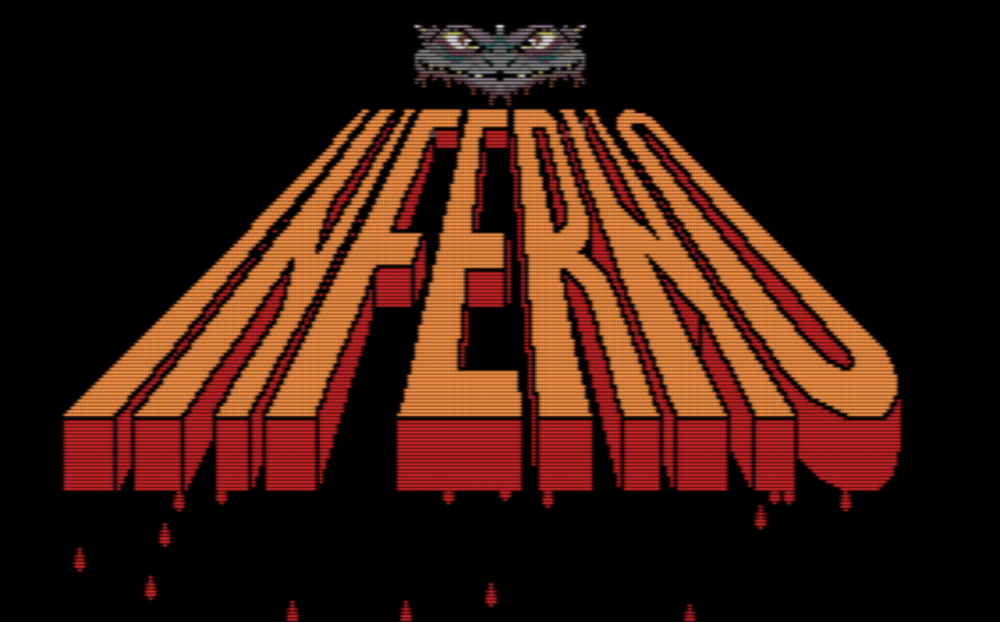
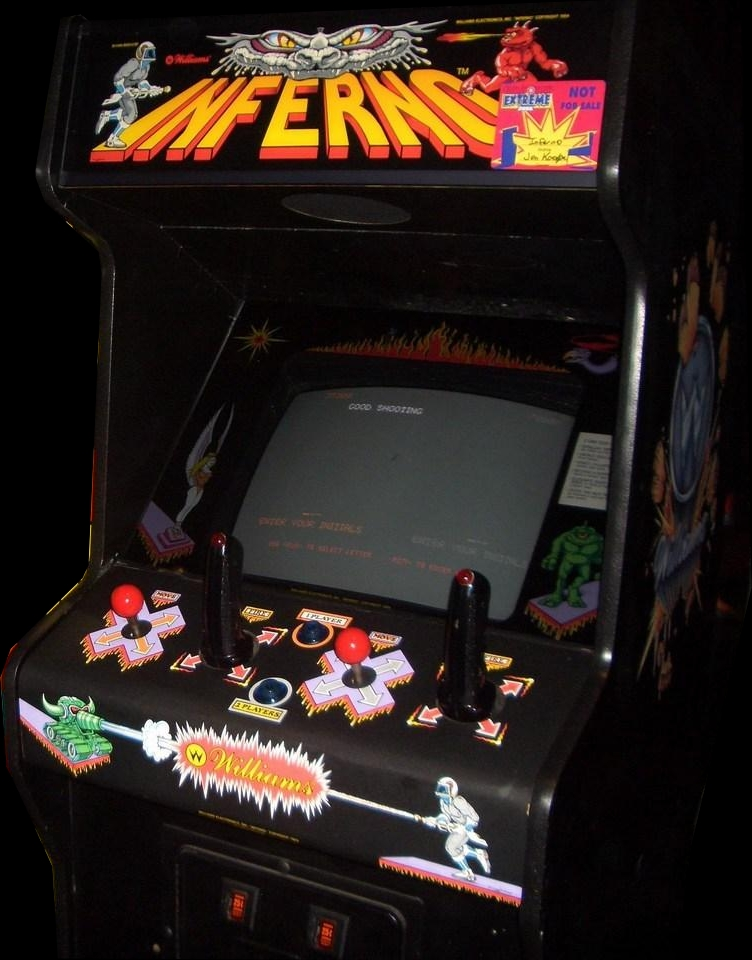

-=(Inferno_Senhor notes)=-

Tested: Working Video 720p, 1080p & Sound.

___
# [Inferno](https://www.arcade-museum.com/game_detail.php?game_id=8191) for [MiSTer FPGA](https://mister-devel.github.io/MkDocs_MiSTer/)



Original core developed by [@darfpga](https://github.com/darfpga) ([Source](https://github.com/darfpga/vhdl_inferno)) for the DE10-Lite.

Ported to MiSTer FPGA by [@JasonA-dev](https://github.com/JasonA-dev) and [@birdybro](https://github.com/birdybro)

## Status

* Inferno gameplay works (graphics, inputs, etc...)

## Description

This is a simulation model of the **Inferno** Williams 2nd Generation arcade hardware. This is a very challenging game that was very creatively designed. Here's the description of the gameplay from the original manual (which is hilarious):

**Laser At The Ready**, the player defends highlands and lowlands alike from the greedy cyclopes Dohrt, Zohrt, and Mohrt (500, 700, and 900 points, respectively). But even a direct hit isn't a victory in this game!

**Dead Cyclopes Tell Tales**, and the player must tag their souls before they do! A cyclops' soul is good for points, in an indirect way. Here's the trick... Players use the soul to liberate a nymph. (Nymphs of course, are trapped in statues by the cyclopes.) Once free, nymphs flit across the screen with such attraction that **all the cyclopes freeze in position... making them easy marks for our hero!**

**Meanwhile The Wily Cyclopes** employ the highest of tech in their stealthy attacks. The player must beware of the crawling tankovs and the hovering boom birds!

**Wise Players** learn two tricks:

1. They can always escape the onrushing enemy by stepping onto the launchpad.
2. If they follow the enemy into the lizard's mouth, they enter the netherworld of the dead. There if they dare, they can achieve even more points by fighting with souls!

**Buy-In Feature.** If during a two-player game, only one of the two players uses up all their lives, they can "buy in" or continue where they left off. Continued games are more challenging than original games. So continued games tend to involve skilled players at the level they prefer **and to increase collections.** To buy in, a player inserts their next coin while "CONTINUE GAME" appears on the screen. Then they push either of the start buttons.

## Controls



| Name            | Description     | Default Mapping                                |
| --------------- | --------------- | ---------------------------------------------- |
| Trigger         | Shoot your gun! | R                                              |
| Coin            | Insert a coin!  | Select                                         |
| Start           | Start the game! | Start                                          |
| Run Upper-Left  | Move NorthWest  | L Analog Stick --> Up+Left    OR D-Pad Left    |
| Run Upper-Right | Move NorthEast  | L Analog Stick --> Up+Right   OR D-Pad Up      |
| Run Lower-Left  | Move SouthWest  | L Analog Stick --> Down+Left  OR D-Pad Down    |
| Run Lower-Right | Move SouthEast  | L Analog Stick --> Down+Right OR D-Pad Right   |
| Aim Upper-Left  | Aim NorthWest   | R Analog Stick --> Up+Left    OR Face Button Y |
| Aim Upper-Right | Aim NorthEast   | R Analog Stick --> Up+Right   OR Face Button X |
| Aim Lower-Left  | Aim SouthWest   | R Analog Stick --> Down+Left  OR Face Button B |
| Aim Lower-Right | Aim SouthEast   | R Analog Stick --> Down+Right OR Face Button A |

Inferno had dual joysticks, the right joystick was like a flight simulator's stick with a trigger on top to fire. This core is best played with dual joysticks (either on a modern gamepad or a custom joystick setup of your own which maps to dual analog). There is also the option to use the D-Pad and face buttons instead to Run and Aim respectively. The D-Pad and face buttons option does not require diagonal inputs.

## Service Menu

Like other Williams arcade hardware, Inferno had a peculiar system of "DIP" switches. See the manual in `doc/` for the original source of the information.

When you press the "Advance" button in the OSD, this enables you to access the bookkeeping totals by then pressing "Auto Up" in the OSD. Currently the data in here is not saved to the MiSTer but that may come at a later time.

If you want to change any options, then press "Auto Up" again to see the Game Adjustments menu. Here you use Player 1 right and left to move to whatever option you want to change and then use the Player 2 right and left inputs to modify the desired setting.

If you press "Advance" again, it will return to it's original state, but "Auto Up" now will cycle through various test programs that the arcade board used to have.

High Score reset is another internal button, and it makes the game pause for a second until the high score resets.

## To-Do

* Fix sound playback, samples are playing at incorrect times or not playing at all.
* Pause not implemented.
* HiScore saving not implemented yet.
* MiSTer DIP system not implemented yet (DIPS are defined away as CPU behavior currently in the PIA due to them not being a standard DIP system)
* Extra input options for multiple controller situations are not complete.

## ROM Files Instructions

ROMs are not included! In order to use this arcade core, you will need to provide the correct ROM file yourself.

To simplify the process .mra files are provided in the releases folder, that specify the required ROMs with their checksums. The ROMs .zip filename refers to the corresponding file from the MAME project.

Please refer to [https://github.com/MiSTer-devel/Main_MiSTer/wiki/Arcade-Roms-and-MRA-files](https://github.com/MiSTer-devel/Main_MiSTer/wiki/Arcade-Roms-and-MRA-files) for information on how to setup and use the environment.

Quick reference for folders and file placement:

```txt
/_Arcade/<game name>.mra
/_Arcade/cores/<game rbf>.rbf
/_Arcade/mame/<mame rom>.zip
/_Arcade/hbmame/<hbmame rom>.zip
```

